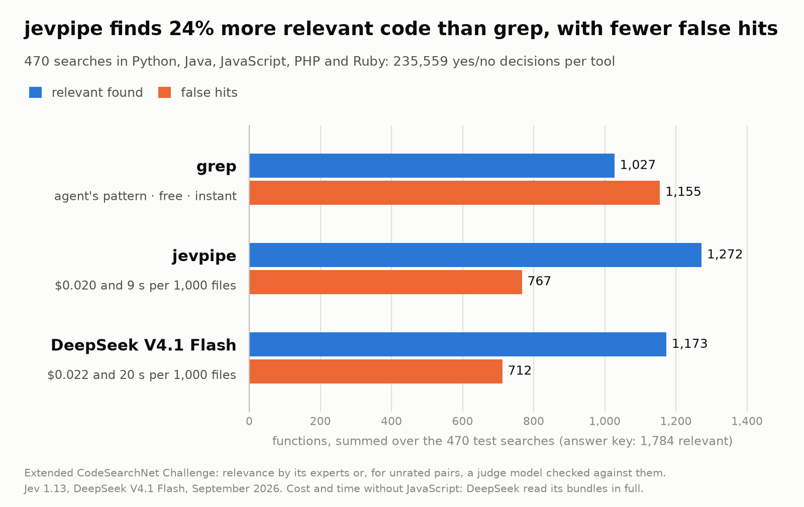
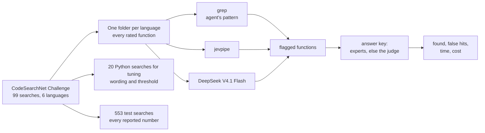
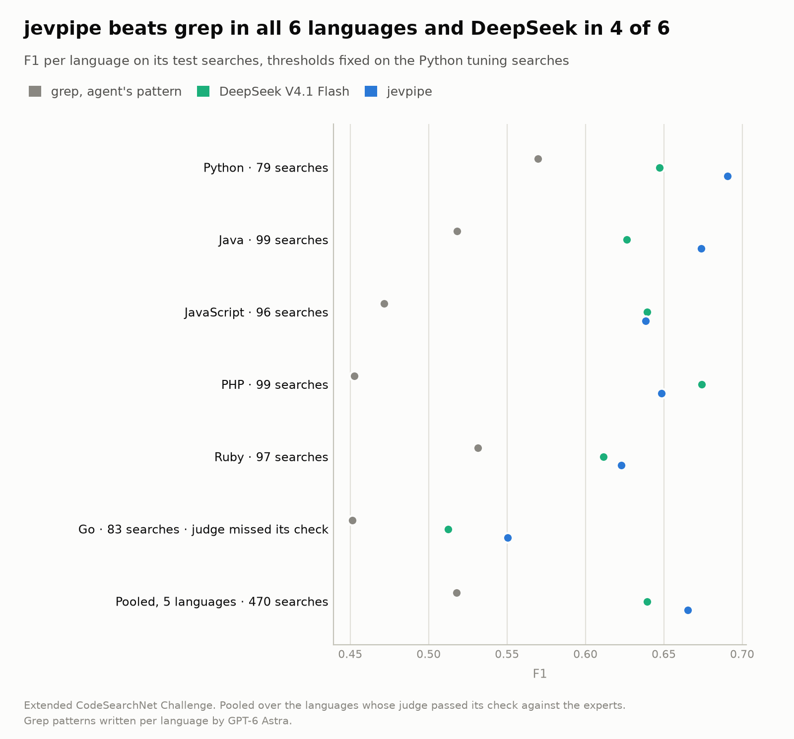
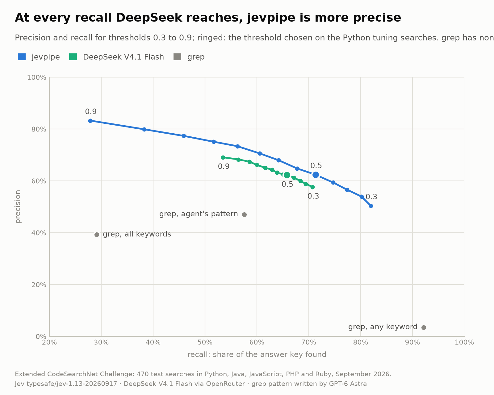
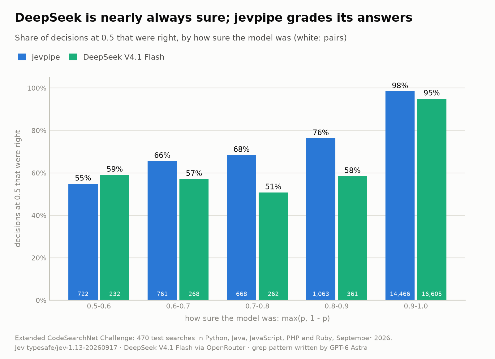
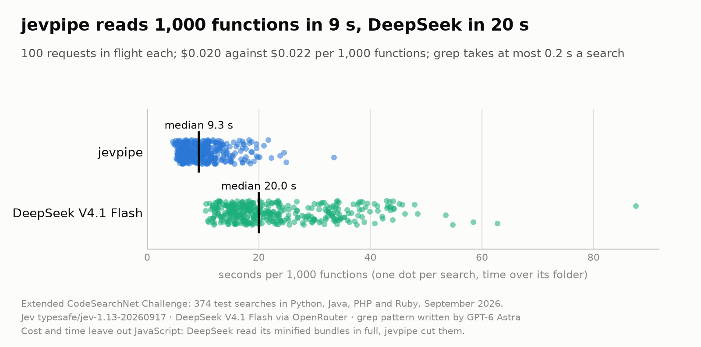
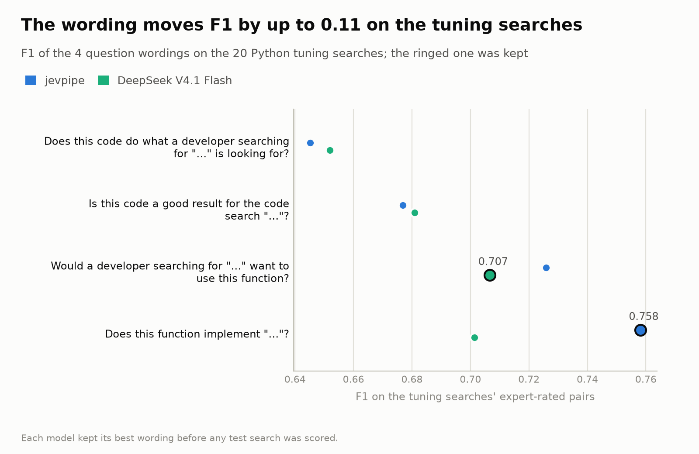

# Searching code with jevpipe, grep or an LLM script

*A small benchmark on the CodeSearchNet Challenge, September 2026.*

**Abstract.** A coding agent that looks for "the code that does X" can grep, pipe the files through
jevpipe, or write a script that asks a cheap LLM about every file. All three got the searches of
the CodeSearchNet Challenge in Python, Java, JavaScript, PHP and Ruby, each over every function of
its language: 470 test searches and 235,559 yes/no decisions per tool. jevpipe found 1,272 of the
1,784 relevant functions in the answer key with 767 false hits; grep with a pattern written by an
agent found 1,027 with 1,155, and DeepSeek V4.1 Flash 1,173 with 712. jevpipe beats grep in every
language, matches or slightly beats DeepSeek, and is twice as fast and a little cheaper.

<a id="figure-1"></a>



*Figure 1. Relevant functions found (blue) and false hits (orange), summed over the 470 test
searches in five languages. Below each tool: what it spent and its median time per 1,000 files,
without JavaScript ([section 3.4](#34-twice-as-fast-and-a-little-cheaper)).*

## 1. The question

grep is instant and free, but it only finds what the agent guesses the code is called. An LLM reads
the code, but a script calling one per file is slow and costs money. jevpipe sits between: a small
decision model that answers one yes/no question per file, 100 files at a time. Which one should an
agent reach for when it needs to find code by what it does?

Jev's accuracy as a classifier has been measured elsewhere, on labelled routing and detection tasks
([an independent study](https://www.ayautomate.com/blog/jev-vs-llm-benchmark)) and on TypeSafe's own
workflows ([TypeSafe](https://typesafe.ai/blog/introducing-system-one-models-and-jev)). This
benchmark covers what those leave out: an agent's tool run over every file of a codebase, against
what the agent would do otherwise.

## 2. The data

### 2.1 What the Challenge contains

The [CodeSearchNet Challenge](https://github.com/github/CodeSearchNet) (GitHub and Microsoft, 2019)
is a public set of 99 short searches, the kind a developer types into a code search box: "copy to
clipboard", "convert json to csv", "get current process id". For each search, experts looked at a
handful of functions from open-source projects and rated each from 0 (irrelevant) to 3 (exactly
what was asked for); a function whose ratings average 2 or more counts as relevant. The same
searches, 83 to 99 of them per language, were rated in six languages: most in Python (2,079
ratings), 166 to 813 in each of Java, JavaScript, PHP, Ruby and Go.

For *"get current process id"* the experts rated eight Python functions. One rated 3 by both experts
who saw it:

```python
def process_id(self):
    ret = ""
    if thread:
        f = getattr(os, "getpid", None)
        if f:
            ret = str(f())
    return ret
```

Among the others are `get_procid(record)`, which reads a process id out of a log record (rated 1,
related), and a debugger's `get_process_id_from_prefix()` (rated 0). All three have "process" and
"id" in their names; only the first returns the id of the current process. Telling them apart is the
task.

### 2.2 One folder per language, every search

An agent searching a codebase does not get a few hand-picked candidates; it gets the whole codebase.
So each language's rated functions go into one folder, one file each with a neutral
name (`0000.py`, `0001.py`, …), and every search runs over every file. In Python that is 99 searches
over 943 functions: 93,357 yes/no decisions per tool. Over all six languages it is 267,782.

### 2.3 The gap, and a judge to fill it

The experts rated only 956 of the 93,357 Python search-function pairs, about 1 in 100; for "get
current process id", 8 of the 943 functions. That leaves a gap. A tool is scored on the functions it
says yes to: each yes is either a relevant function (found) or not (a false hit). When a tool says
yes to a function the experts never rated for that search, there is no rating to tell which.

Filling the gap takes far fewer ratings than 93,357, because the tools say no to almost everything:
for "get current process id", the tools said yes to only one function the experts had not rated.
Across Python's 99 searches, they flagged 1,118 such pairs; for this, a model counted as flagging a
function from a probability of 0.3, the lowest threshold scored later, and DeepSeek also from a plain
yes. A second model rates exactly those: GPT-6 Astra, on the experts' 0-3 scale, seeing only the search and the code, never which
tool flagged it. It also rated every pair the experts had rated, to check it first, and two random
samples of what the tools passed over, which [section 2.4](#24-the-answer-key-and-recall) uses to
check what they missed:

| Why the judge rated a Python pair | Pairs |
|---|---:|
| an expert had rated it: the check of the judge | 956 |
| a tool flagged it, and no expert had rated it | 1,118 |
| random sample: only a loose any-keyword grep matched it (up to 20 per search; 104 more were already flagged) | 1,749 |
| random sample: not even that grep matched it (10 per search) | 990 |
| **total** | **4,813** |

**Can a model stand in for the experts?** In every language it was tested first on the pairs the
experts had rated, comparing verdicts (relevant or not):

| | Python | Java | JavaScript | PHP | Ruby | Go |
|---|---:|---:|---:|---:|---:|---:|
| the judge and the experts give the same verdict | 76% | 79% | 83% | 79% | 83% | 80% |
| two experts give the same verdict | 70% | | | | | |
| the judge passed the check set in advance | yes | yes | yes | yes | yes | **no** |

Most pairs are irrelevant, so agreeing on them is easy; the check therefore looks at the relevant
ones. Before judging, the judge had to find most of the functions the experts called
relevant, and most of the functions it called relevant had to be ones the experts did too (an F1 of at
least 0.67; Python's experts reach 0.71 against each other). Only Python has enough pairs rated by
two experts (848) to compare the experts with each other, and there the judge agrees with them more
often than they agree among themselves: measured the same way on those 848 pairs, against the
average of the other experts, the judge gives the same verdict in 74% (F1 0.74) and the first
expert in 70% (F1 0.71). Go has only 40 relevant expert pairs, and the judge called
more of the rest relevant than Go's experts did, so it missed the check. Go is therefore shown in the
results but left out of every pooled number. [Appendix B](#appendix-b) has the details.

### 2.4 The answer key and recall

Recall asks: of all the functions relevant to a search, how many did the tool find? Strictly, that
needs someone to have checked every function for every search, and nobody did. What has been checked
is every function the experts rated and every function a tool said yes to. The relevant ones among
those form the **answer key**: 604 relevant pairs for Python's test searches, 253 of which no expert
ever saw (a tool found them and the judge confirmed them), and 1,784 over the five pooled languages.
A tool's recall is the share of the answer key it found.

The answer key misses relevant functions that none of the three tools said yes to and no expert
rated. To see how many, the judge rated random samples of those pairs. Among 4,700 functions that not
even a loose any-keyword grep matched, 2 were relevant. Among functions only that loose grep matched,
some were: in Python the samples suggest about 90 relevant pairs beyond the answer key, 695 instead
of 604. Counted against that, every recall drops by about an eighth and the order stays the same:
jevpipe 0.62, DeepSeek 0.57, grep 0.48 ([appendix B](#appendix-b)).

### 2.5 Tuning and testing

Twenty of Python's 99 searches were set aside for tuning: on them, each model's question wording and
threshold were chosen, once, for every language. The other 79 Python searches and every search in
the other five languages are **test searches**. Nothing was tuned on them, and every result below
comes from them, like practice questions and an exam.

### 2.6 At a glance

| The benchmark in numbers | Python | Java | JavaScript | PHP | Ruby | Go | All six |
|---|---:|---:|---:|---:|---:|---:|---:|
| Searches | 99 | 99 | 96 | 99 | 97 | 83 | 573 |
| … of them test searches | 79 | 99 | 96 | 99 | 97 | 83 | 553 |
| Functions in the folder | 943 | 758 | 304 | 288 | 292 | 161 | 2,746 |
| Yes/no decisions per tool | 93,357 | 75,042 | 29,184 | 28,512 | 28,324 | 13,363 | 267,782 |
| Pairs rated by the experts | 956 | 769 | 305 | 289 | 300 | 162 | 2,781 |
| Pairs rated only by the judge | 3,857 | 3,561 | 3,004 | 2,976 | 2,814 | 2,133 | 18,345 |
| Relevant pairs in the answer key (test) | 604 | 512 | 247 | 232 | 189 | 79 | 1,863 |



A flagged function is **found** when the answer key says it is relevant and a **false hit** when it
says it is not.

The searches, the functions with their code and license, and every rated pair are published as the
[extended CodeSearchNet Challenge](https://huggingface.co/datasets/Scoolar/codesearchnet-challenge-extended),
for testing other search tools the same way.

## 3. Findings

### 3.1 Across five languages, jevpipe finds the most

| Tool, pooled over 470 searches | Found | False hits | Precision | Recall | F1 |
|---|---:|---:|---:|---:|---:|
| grep, agent's pattern | 1,027 | 1,155 | 0.47 | 0.58 | 0.52 |
| **jevpipe** | **1,272** | 767 | 0.62 | **0.71** | **0.67** |
| DeepSeek V4.1 Flash | 1,173 | **712** | 0.62 | 0.66 | 0.64 |

<a id="figure-2"></a>



*Figure 2. F1 per language. jevpipe beats grep in every language. Against DeepSeek it is ahead in
Python, Java, Ruby and Go, level in JavaScript and behind in PHP; Go, whose judge missed its check,
is shown but not pooled.*

The two models are equally precise overall; jevpipe's edge is that it finds more. How sure are
these differences? Resampling the searches 10,000 times, within each language, gives these 95% intervals for the
gap in F1:

| Gap in F1 | Python alone (79 searches) | Pooled (470 searches) |
|---|---:|---:|
| jevpipe over grep | +0.12 (+0.03 to +0.22) | **+0.15 (+0.11 to +0.19)** |
| DeepSeek over grep | +0.08 (+0.01 to +0.15) | **+0.12 (+0.08 to +0.16)** |
| jevpipe over DeepSeek | +0.04 (−0.02 to +0.10) | +0.03 (−0.01 to +0.06) |

Both models clearly beat grep. jevpipe is ahead of DeepSeek in 93% of the resamples, not quite
enough to call it a sure win; adding Go changes none of this. Search by search, jevpipe found more
relevant functions than grep in 155 of the 470 searches, grep more in 75, and they tied in 240.

### 3.2 The lead holds at every recall



*Figure 3. The 470 test searches of the five pooled languages. Each dot is one threshold; the large
dots are the thresholds chosen on the tuning searches, 0.5 for both, which also gives jevpipe its
best F1 here. Wherever the two models reach
the same recall, jevpipe is more precise. Lowering jevpipe's threshold to 0.3 finds 82% of the
answer key at 50% precision.*

### 3.3 jevpipe's probabilities carry information



*Figure 4. DeepSeek is 0.9 or more sure of 94% of these answers, and below that it is right 51% to
59% of the time. jevpipe spreads its answers over the scale and is right more often the surer it
is, from 55% to 98%, so its probability is worth sorting by or thresholding. The pairs shown are the
labelled ones, which lean towards hard cases.*

### 3.4 Twice as fast, and a little cheaper



*Figure 5. Each dot is one search over its language's folder, 100 requests in flight for both
models, scaled to 1,000 functions. JavaScript is left out: its pool holds two minified bundles of
0.3 and 1.3 MB, which jevpipe cut at 100,000 characters and DeepSeek read in full on every search,
because the benchmark did not cut them for it. With JavaScript the medians are 10 s and 24 s. Run a second
time on five Python searches, jevpipe changed 1 of 4,715 decisions and DeepSeek 7.*

The cost depends on the code. DeepSeek is paid per token it reads, so its cost follows the length of
the functions; jevpipe cuts long files at 100,000 characters, so its cost rises far less:

| Median per 1,000 files | Python | Java | JavaScript | PHP | Ruby | Go |
|---|---:|---:|---:|---:|---:|---:|
| mean function length (characters) | 789 | 666 | 6,268 | 641 | 463 | 516 |
| jevpipe | $0.021 | $0.020 | $0.030 | $0.020 | $0.017 | $0.019 |
| DeepSeek V4.1 Flash | $0.027 | $0.020 | $0.158 | $0.021 | $0.016 | $0.019 |

In JavaScript the two bundles made DeepSeek's searches seven times as expensive as jevpipe's
($6.13 against $0.87 for all 96), a cost of the setup rather than of the model, so every cost and
time above leaves JavaScript out. Over the test searches of the other four pooled languages,
jevpipe spent $4.08 and DeepSeek $4.60: $0.020 against $0.022 per 1,000 files. Prices are
OpenRouter's in September 2026 and will change. Jev is TypeSafe's first System One model; DeepSeek
V4.1 Flash is a mature, cache-priced model.

### 3.5 The question wording matters



*Figure 6. On the Python tuning searches, asking about the code directly ("Does this function
implement …?") beat asking about the searcher by 0.03 to 0.11 F1 for jevpipe. DeepSeek did best with the
third wording. Each model kept its own best, for every language, before any test search was
scored.*

### 3.6 A closer look: where grep loses, where jevpipe loses

Two telling cases in Python, one each way:

**grep loses: "matrix multiply".** The agent's pattern looked for names like `matmul` and
`matrix_multiply` and for calls like `np.dot(`, a fair guess. But the 8 relevant functions are
named `__mul__`, `multiply` and `mxmg`, and none of them calls `np.dot(`. This one, from
[QNET](https://github.com/mabuchilab/QNET/blob/cc20d26dad78691d34c67173e5cd67dcac94208a/src/qnet/algebra/core/matrix_algebra.py#L136-L140),
multiplies matrices without a single word grep could match:

```python
def __mul__(self, other):
    if isinstance(other, Matrix):
        return Matrix(self.matrix.dot(other.matrix))
    else:
        return Matrix(self.matrix * other)
```

grep found none of the 8; its 3 hits were long numerical routines that call `np.dot` somewhere.
jevpipe flagged all 8, this one at 0.85, plus 3 loosely related functions; DeepSeek flagged 6 of the
8. The agent's patterns are in [`results/patterns.json`](results/patterns.json) for Python and in
`results/<language>/patterns.json` for the others.

**jevpipe loses: qualifiers the code cannot show.** grep's two biggest wins were *"how to read .csv
file in an efficient way?"* (grep 10 of 10, jevpipe 0) and *"unzipping large files"* (grep 12 of 12,
jevpipe 1). jevpipe took the qualifiers literally: it gave the ten functions that read CSV files 0.2
to 0.4, as none of them shows that it is efficient, and the unzip functions 0.1 to 0.2, as nothing in
them is about large files. DeepSeek said yes to 6 of the 10 and 10 of the 12. The raters counted
plain readers and unzippers as relevant.

## 4. Recommendation

- **Keep jevpipe's default threshold of 0.5**: it had the best F1 on both the tuning and the test
  searches. Use 0.3 when missing a function costs more than reading a false hit.
- **Ask about the code, not the searcher**: "Does this function implement X?" rather than "Is this
  what someone searching for X wants?".
- **Leave out what the code cannot show**: jevpipe judges what is on the page. Ask "Does this
  function read a CSV file?", not "... in an efficient way?", and filter for size or speed some
  other way.

## 5. Limitations

- The functions are public GitHub code from 2019 and may be in both models' training data.
- Function-sized snippets and one task. A folder of 99 topics is easier than a search inside one
  project, where most files are about the same thing.
- Outside Python the experts rated two to eight functions per search (about three in JavaScript,
  PHP and Ruby), nearly all of them once, so the answer key there rests more on the judge; in Go the judge missed its check, and Go is left out of the pooled
  results.
- Recall is measured against the answer key, which can miss what every tool missed;
  [appendix B](#appendix-b) estimates how much.
- The judge is a model, checked against the experts but not one of them.
- Times come from one machine on one home connection over one night and one morning.

## Appendix

<a id="appendix-a"></a>

<details>
<summary><strong>A. Contenders, exactly</strong></summary>

- **jevpipe**: `jevpipe map --read-files --model typesafe/jev-1.13 --concurrency 100 -q '{"match":
  {"type": "noul", "instructions": <question>}}'`, run in the pool folder with the file names on
  standard input. The model that answered, `typesafe/jev-1.13-20260917`, was recorded at the start
  of every run. Python, Java and the first 27 JavaScript searches ran on jevpipe 0.1.0 as released.
  Two minified JavaScript bundles were then rejected as too large even after jevpipe's cut to 100,000
  characters, so jevpipe 0.1.1 halves such a file and asks again; the other searches ran on 0.1.1,
  and the two bundles were asked again with 0.1.1 in the first 27 JavaScript searches. Runs from
  0.1.1 on record the jevpipe version; the earlier ones predate that field. No other search had a
  failed record. One Java function, `0030.java`, is empty at its rated lines; jevpipe skips empty
  files without asking, so it never flags it (its one expert rating is 0).
- **DeepSeek V4.1 Flash** (`deepseek/deepseek-v4.1-flash`) through OpenRouter, one chat request per
  file: system message "You judge one file at a time. Answer with exactly one word: yes or no.", then
  the question, the file name and the code; temperature 0, at most 5 tokens, reasoning off, 100
  requests in flight. The probability of yes is `p(yes) / (p(yes) + p(no))` from the first token's
  log probabilities. Requests route only to providers that return log probabilities
  (`require_parameters`); Novita claims to but did not, so it is excluded. These runs made up to three
  attempts when a request failed or an answer came without a probability; no request failed, and
  three answers (two in PHP, one in Ruby) count by their yes or no. The code now retries the way
  jevpipe does (five attempts, only on timeouts, rate limits and server errors, honouring
  `Retry-After`) and reads the probability from the first token that holds yes or no.
- **grep**: ripgrep 15.2.0, case-insensitive, file names only, over the pool folder.
  - *agent's pattern*: GPT-6 Astra wrote one regular expression per search and language from the
    search alone, before any tool ran, told to search a codebase of that language as a coding agent
    would (synonyms, abbreviations, identifier forms). They are in `results/**/patterns.json`.
  - *any keyword* and *all keywords*: the search's words without filler words (a, an, the, to, of,
    from, in, on, for, and, or, is, how, with, into, by, based, another, x).
- **Wordings** tried on the Python tuning searches, F1 on their expert-rated pairs (Jev at 0.5,
  DeepSeek on its yes/no answer; the code now scores both with the rule the test searches use):

  | Wording | jevpipe | DeepSeek |
  |---|---:|---:|
  | Does this code do what a developer searching for "…" is looking for? | 0.645 | 0.652 |
  | Is this code a good result for the code search "…"? | 0.677 | 0.681 |
  | Would a developer searching for "…" want to use this function? | 0.726 | **0.707** |
  | Does this function implement "…"? | **0.758** | 0.701 |

- **Order**: jevpipe ran first on even-numbered searches, DeepSeek on odd ones.
- **Tuning searches** (seed 5): q01, q03, q06, q13, q14, q20, q31, q32, q45, q47, q48, q59, q60, q67,
  q69, q73, q79, q83, q88, q94. Search ids are the same in every language.

</details>

<a id="appendix-b"></a>

<details>
<summary><strong>B. Labels, the judge and what everyone missed</strong></summary>

- **Dataset**: `resources/annotationStore.csv` of
  [github/CodeSearchNet](https://github.com/github/CodeSearchNet) at commit `106e8274`. Each function
  is cut to the rated lines of the rated commit. Some source URLs no longer resolve: 31 in Python,
  41 in Java, 14 in JavaScript, 25 in PHP, 13 in Ruby and 4 in Go.
- **Judge**: GPT-6 Astra through the Codex CLI (`codex exec`, low reasoning effort, read-only
  sandbox, an empty working folder, no tools used), on the experts' 0-3 scale with each level
  described as in the Challenge's annotation guide. It sees an opaque id, the search and the code
  (cut at 20,000 characters, which only three JavaScript functions exceed); batches of 40 mix searches
  and tools in a seeded order. An expert rating always wins over the judge's.
- **Validation**: each rater's verdict is "relevant" when its rating (or the experts' average) is 2
  or more. In Python, on the 956 expert-rated pairs, the judge called 459 relevant and the experts
  427; they agree on 330 of those, and on 730 of all 956 pairs (76%). So of the judge's "relevant",
  72% are relevant by the experts (precision 0.719), and of the experts' "relevant", the judge caught
  77% (recall 0.773), F1 0.745. Between experts, on the 848 pairs with two or more ratings, the first
  expert's verdict against the average of the others agrees on 597 (70%), with F1 0.711; the
  judge's verdict against that same average agrees on 628 (74%), with F1 0.739. In the other
  languages the judge reached F1 0.719 (Java, 769 pairs), 0.781 (JavaScript, 305), 0.760 (PHP, 289),
  0.709 (Ruby, 300) and 0.629 (Go, 162); the check set in advance required 0.67.
- **What was judged**: every unrated function flagged by jevpipe at 0.3 or more, by DeepSeek (yes
  or 0.3 or more), by the agent's pattern or by the all-keywords grep; 20 random any-keyword hits
  per search; and 10 random functions per search that no tool flagged. Every selected pair was rated,
  so no count above rests on an unjudged pair.
- **What everyone missed**: of the 4,700 unflagged functions sampled for the pooled test searches, 2
  were relevant. In Python none of 790 was: with 95% confidence fewer than 0.38% of its 58,133
  unflagged pairs are relevant, at most about 220. Python's any-keyword sample suggests another 91
  among that grep's unlabelled hits; counting those, Python's test searches hold about 695 relevant
  functions, and recall against that is 0.62 for jevpipe, 0.57 for DeepSeek and 0.48 for the agent's
  pattern.

</details>

<a id="appendix-c"></a>

<details>
<summary><strong>C. All numbers</strong></summary>

Every language's numbers, including every threshold from 0.3 to 0.9, the confidence bands and the
raw totals, are in `results/**/numbers.md` and `results/**/results.json`; the pooled numbers and the
intervals in [`results/languages.json`](results/languages.json).

| Language | Tool | Found | False hits | Precision | Recall | F1 |
|---|---|---:|---:|---:|---:|---:|
| Python | grep, agent's pattern | 333 | 232 | 0.589 | 0.551 | 0.570 |
| | jevpipe | 431 | 213 | 0.669 | 0.714 | 0.691 |
| | DeepSeek V4.1 Flash | 398 | 228 | 0.636 | 0.659 | 0.647 |
| Java | grep, agent's pattern | 299 | 343 | 0.466 | 0.584 | 0.518 |
| | jevpipe | 377 | 230 | 0.621 | 0.736 | 0.674 |
| | DeepSeek V4.1 Flash | 364 | 286 | 0.560 | 0.711 | 0.627 |
| JavaScript | grep, agent's pattern | 141 | 210 | 0.402 | 0.571 | 0.472 |
| | jevpipe | 165 | 105 | 0.611 | 0.668 | 0.638 |
| | DeepSeek V4.1 Flash | 149 | 70 | 0.680 | 0.603 | 0.639 |
| PHP | grep, agent's pattern | 136 | 233 | 0.369 | 0.586 | 0.453 |
| | jevpipe | 166 | 114 | 0.593 | 0.716 | 0.648 |
| | DeepSeek V4.1 Flash | 151 | 65 | 0.699 | 0.651 | 0.674 |
| Ruby | grep, agent's pattern | 118 | 137 | 0.463 | 0.624 | 0.532 |
| | jevpipe | 133 | 105 | 0.559 | 0.704 | 0.623 |
| | DeepSeek V4.1 Flash | 111 | 63 | 0.638 | 0.587 | 0.612 |
| Go (not pooled) | grep, agent's pattern | 44 | 72 | 0.379 | 0.557 | 0.451 |
| | jevpipe | 49 | 50 | 0.495 | 0.620 | 0.551 |
| | DeepSeek V4.1 Flash | 41 | 40 | 0.506 | 0.519 | 0.512 |

In Python, two mechanical greps on the search's keywords did worse than the agent's pattern: all
keywords found 181 with 217 false hits (F1 0.361), any keyword about 655 with about 15,554 (F1
0.078; it flags 205 functions per search, so its counts are estimated from its judged sample, and
never below the relevant hits already known).

Spend on OpenRouter: $17.11 for the pool runs of all six languages ($4.45 of it Python, $7.00
JavaScript because of the two bundles), about $17.40 with the wording trials, the repeats and the
retries.

</details>

<a id="appendix-d"></a>

<details>
<summary><strong>D. Run it again</strong></summary>

Everything needed to recompute the numbers and the figures is in [`results/`](results/): `uv run
bench score` does it offline in a few seconds. To rerun from scratch you need uv, ripgrep on the
path, jevpipe 0.1.1, a logged-in Codex CLI with GPT-6 Astra, and `OPENROUTER_API_KEY` with about $18
of credit:

```sh
cd bench
uv run bench prepare    # ratings, functions, pool, split (free); --language for the others
uv run bench patterns   # the agent's grep patterns (Codex); per --language
uv run bench wordings   # the four wordings on the Python tuning searches (about $0.04)
uv run bench run        # every search over the pool; per --language (Python about $4.50)
uv run bench repeat     # 5 Python searches again (about $0.25)
uv run bench judge      # validation, the gate, then the rest (Codex); per --language
                        # (Go needs --continue-judging, as its judge misses the gate)
uv run bench score      # every results file and figure (offline)
uv run bench licenses   # each source repository's license, for the dataset (GitHub)
uv run bench export     # queries, corpus, qrels and the dataset card
```

`export` writes the files of the published
[dataset](https://huggingface.co/datasets/Scoolar/codesearchnet-challenge-extended) to
`.cache/export/`.

Every stage resumes: finished searches and batches are skipped, and a search cut short by a spend
limit runs again from its start. `bench run --retry-failed` asks both models again about the
records a stored run left unanswered. `BENCH_JEVPIPE` points the runs at a jevpipe binary other than
the one on the path. `./check.ps1` runs the benchmark's own offline checks.

</details>
